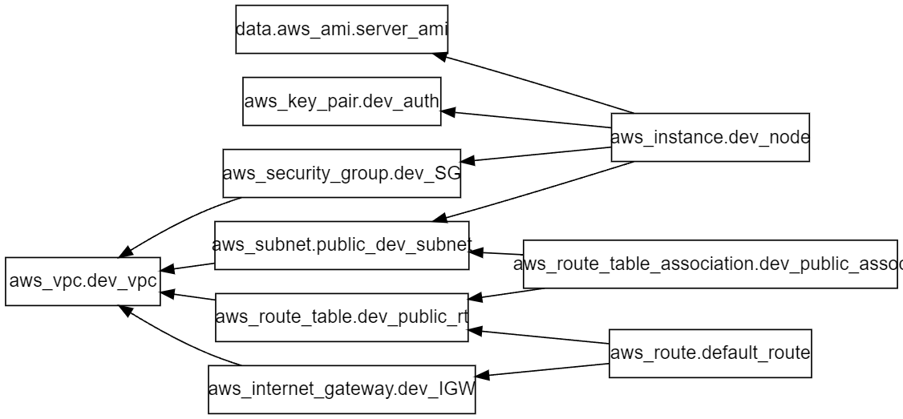

# Project Overview :: Dev Environemt Using Terraform 
This Terraform project sets up a foundational AWS infrastructure suitable for a development environment. The diagram visualizes the dependencies between various resources, illustrating how they come together to create a secure, scalable, and manageable environment for development activities.

## Getting Started with Terraform and AWS

1. **Install Terraform:**
   - Download and install Terraform from the official website. Ensure that it's properly added to your system's PATH so you can run Terraform commands from the terminal.

2. **Set Up AWS CLI:**
   - Install the AWS Command Line Interface (CLI) and configure it with your AWS credentials (Access Key ID and Secret Access Key). This will allow Terraform to interact with your AWS account.

3. **Create a Terraform Configuration File:**
   - Start by creating a `.tf` file that defines your infrastructure. Begin with the basic configuration, such as setting up the provider (AWS) and defining the resources like VPC, subnets, security groups, etc.

4. **Initialize Terraform:**
   - Run `terraform init` to initialize the working directory containing your configuration files. This will download the necessary provider plugins.

5. **Plan Your Infrastructure:**
   - Use `terraform plan` to see what Terraform will do when you apply the configuration. This step helps you verify that your configuration is correct and understand the changes that will be made.

6. **Apply the Configuration:**
   - Execute `terraform apply` to create the resources defined in your configuration file. Review the execution plan and confirm to proceed with the deployment.

7. **Monitor and Manage:**
   - Once the resources are created, you can manage them using Terraform. Modify the configuration files as needed, and reapply to update your infrastructure.

8. **Destroy the Environment:**
   - When the development environment is no longer needed, run `terraform destroy` to clean up all the resources created. This ensures that you don't incur unnecessary costs.

   

## Resource Breakdown

1. **VPC (`aws_vpc.dev_vpc`):**
   - Acts as the isolated network within AWS, ensuring that the development environment is secure and isolated from other environments (e.g., production).

2. **Subnets (`aws_subnet.public_dev_subnet`):**
   - A public subnet is created within the VPC, designed to host resources that require internet access, such as development servers or tools.

3. **Internet Gateway (`aws_internet_gateway.dev_IGW`):**
   - Provides internet access to the resources within the public subnet, allowing developers to download dependencies, update systems, and interact with external APIs.

4. **Route Table and Route (`aws_route_table.dev_public_rt` and `aws_route.default_route`):**
   - Configures the routing for the subnet, directing outbound traffic to the internet gateway. This setup is crucial for development tasks that require connectivity to the internet, such as fetching code repositories or connecting to CI/CD pipelines.

5. **Security Group (`aws_security_group.dev_SG`):**
   - Implements security controls, allowing specific inbound traffic (e.g., SSH, HTTP/HTTPS) to the EC2 instance. This enables secure access for developers and ensures that only necessary ports are exposed, reducing the attack surface.

6. **Key Pair (`aws_key_pair.dev_auth`):**
   - Manages SSH keys for secure access to the EC2 instance. This allows developers to securely log in to the development server, perform debugging, or run tests.

7. **AMI (`data.aws_ami.server_ami`):**
   - Specifies the Amazon Machine Image (AMI) used to launch the EC2 instance. This AMI could be pre-configured with development tools, libraries, and environments, speeding up the setup process for developers.

8. **EC2 Instance (`aws_instance.dev_node`):**
   - The primary compute resource in this environment, where development work is conducted. This instance can be used to run applications, test new features, or simulate production workloads.

9. **Route Table Association (`aws_route_table_association.dev_public_assoc`):**
   - Ensures the correct routing of traffic within the subnet by associating the route table with the subnet. This is vital for maintaining the integrity and functionality of the network setup.

   

## How This Serves as a Development Environment

- **Isolated Yet Accessible:**
  - The environment is isolated within its own VPC, preventing unintended interactions with other environments. However, the public subnet and internet gateway allow developers to access the resources remotely, which is particularly useful for distributed teams.

- **Scalable Setup:**
  - This infrastructure can easily be scaled up or down based on the team's needs. Additional instances, subnets, or security groups can be added without significant reconfiguration, making it adaptable to different project requirements.

- **Pre-Configured for Development:**
  - The use of a specific AMI ensures that the environment is pre-configured with the necessary tools, reducing setup time for developers. They can start coding, testing, and deploying their applications without worrying about the underlying infrastructure.

- **Secure Access:**
  - With the key pair and security group in place, only authorized developers can access the EC2 instances, ensuring that sensitive code or data remains secure.

- **Integrated Networking:**
  - The route table and internet gateway setup provide the necessary connectivity for interacting with external services, APIs, or repositories, making it easier to integrate with CI/CD pipelines, deploy code, or fetch updates.

## Conclusion
This Terraform project demonstrates the ability to automate the provisioning of a secure, scalable, and accessible development environment on AWS. It leverages best practices in infrastructure as code (IaC) and provides a robust foundation for development activities, enabling teams to focus on coding and testing rather than managing infrastructure.
